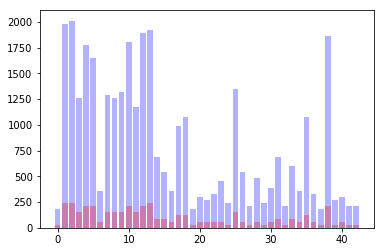
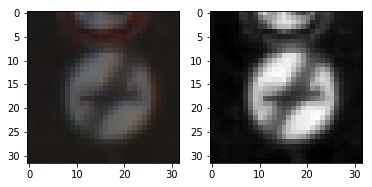
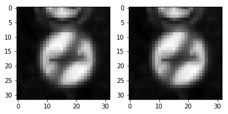
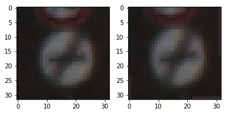
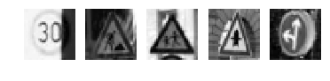
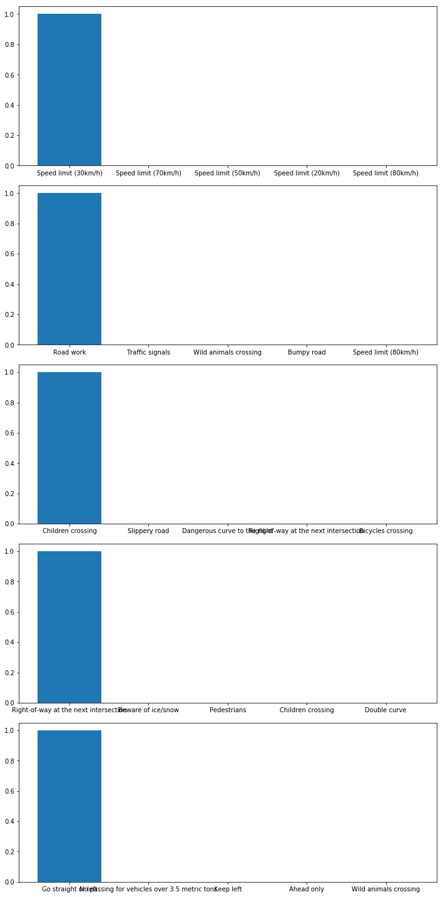

### Project Writeup

Once you have completed the code implementation, document your results in a project writeup using this [template](https://github.com/udacity/CarND-Traffic-Sign-Classifier-Project/blob/master/writeup_template.md) as a guide. The writeup can be in a markdown or pdf file. 

#### 1. Provide a basic summary of the data set and identify where in your code the summary was done. In the code, the analysis should be done using python, numpy and/or pandas methods rather than hardcoding results manually.

The code for this step is contained in the second code cell of the IPython notebook.

I used the numpy to calculate summary statistics of the traffic signs data set:

Number of training examples = 34799
Number of testing examples = 12630
Image data shape = (32, 32, 1)
Number of classes = 43

#### 2. Include an exploratory visualization of the dataset and identify where the code is in your code file.

The code for this step is contained in the third code cell of the IPython notebook.

Here is an exploratory visualization of the data set. It is a bar chart showing how the data ...


```python
train_label=np.zeros(len(dict_label))
for v in y_train:
    train_label[v]+=1
valid_label=np.zeros(len(dict_label))
for v in y_valid:
    valid_label[v]+=1
plt.bar(range(len(train_label)),train_label,alpha=0.3,color='b')
plt.bar(range(len(valid_label)),valid_label,alpha=0.3,color='r')
```


    <Container object of 43 artists>





### Design and Test a Model Architecture

#### 1. Describe how, and identify where in your code, you preprocessed the image data. What tecniques were chosen and why did you choose these techniques? Consider including images showing the output of each preprocessing technique. Pre-processing refers to techniques such as converting to grayscale, normalization, etc.

The code for this step is contained in the 18th code cell of the IPython notebook.

As a first step, I decided to convert the images to grayscale because the LeNet Architecture accept 1 channel image.

Here is an example of a traffic sign image before and after grayscaling.


```python
fig, ax = plt.subplots(1,2)
ax[0].imshow(X_train[0])
ax[1].imshow(cv2.cvtColor(X_train[0],cv2.COLOR_RGB2GRAY))
```


    <matplotlib.image.AxesImage at 0x7fdb3401aa58>





As a last step, I normalized the image data because the images have different contrast.
Here is an example of a traffic sign image before and after normalization.


```python
fig, ax = plt.subplots(1,2)
ax[0].imshow(cv2.cvtColor(X_train[0],cv2.COLOR_RGB2GRAY))
ax[1].imshow(preProcessImage(X_train[0]))
```


    <matplotlib.image.AxesImage at 0x7fdb2ebf1fd0>





#### 2. Describe how, and identify where in your code, you set up training, validation and testing data. How much data was in each set? Explain what techniques were used to split the data into these sets. (OPTIONAL: As described in the "Stand Out Suggestions" part of the rubric, if you generated additional data for training, describe why you decided to generate additional data, how you generated the data, identify where in your code, and provide example images of the additional data)

My final training set had 42000 number of images. My validation set and test set had 4410 and 12630 number of images.

The seventh code cell of the IPython notebook contains the code for augmenting the data set. I decided to generate additional data because the umber of examples per label is not equal.
To add more data to the the data set, I used the affine transformation because it's same as changing camera angle.
Here is an example of an original image and an augmented image:


```python
fig, ax = plt.subplots(1,2)
ax[0].imshow(X_train[0])
ax[1].imshow(generateFake(X_train[0]))
```


    <matplotlib.image.AxesImage at 0x7fdb2eaf3f60>





#### 3. Describe, and identify where in your code, what your final model architecture looks like including model type, layers, layer sizes, connectivity, etc.) Consider including a diagram and/or table describing the final model.

The code for my final model is located in the 25th cell of the ipython notebook.

My final model consisted of the following layers:

| Layer                    | Description | 
|:-------------------------|:------------|
| Input                    | 32x32x1 image |
| Convolution 3*3          | 1x1 stride, valid padding, outputs 30x30x6   |
| RELU                     |  　　|
| Convolution 3*3          | 1x1 stride, valid padding, outputs 28x28x16   |
| RELU                     |  　　|
| Max pooling              | 2x2 stride, outputs 14x14x16　|
| Convolution 3*3          | 1x1 stride, valid padding, outputs 12x12x26   |
| RELU                     |  　　|
| Convolution 3*3          | 1x1 stride, valid padding, outputs 10x10x36   |
| RELU                     |  　　|
| Max pooling              | 2x2 stride, outputs 5x5x36　|
| Convolution 5*5          |   1x1 stride, valid padding, outputs 1x1x4000   |
| RELU                     |  　　|
| Fully connected          | outputs 2000   |
| RELU                     |  　　|
| Fully connected          | outputs 1000   |
| RELU                     |  　　|
| Fully connected          | outputs 500   |
| RELU                     |  　　|
| Fully connected          | outputs 100   |
| RELU                     |  　　|
| Fully connected          | outputs 84   |
| RELU                     |  　　|
| Fully connected          | outputs 42   |

#### 5. Describe the approach taken for finding a solution. Include in the discussion the results on the training, validation and test sets and where in the code these were calculated. Your approach may have been an iterative process, in which case, outline the steps you took to get to the final solution and why you chose those steps. Perhaps your solution involved an already well known implementation or architecture. In this case, discuss why you think the architecture is suitable for the current problem.

The code for calculating the accuracy of the model is located in the below cell of the Ipython notebook.

My final model results were:

### 6. About the training  
This is the hyperparameter which I use.  
About epoch and batch size, I tried several combinations and chose things that learned satisfactorily.  
I chose a small value for batch size from the viewpoint of memory consumption.

| parameter     | value | 
|:--------------|:-------|  
| learning rate | 0.001  |  
| epochs        |  10    |  
| batch size    | 100    |  

```python
with tf.Session() as sess:
    saver.restore(sess,'./Deepnet')
    training_accuracy = sess.run(accuracy_operation, feed_dict={x: X_train_prepro, y: y_train, keep_prob1: 1.0,keep_prob2:1.0,keep_prob3:1.0,keep_prob4:1.0})
    print('training set accuracy of ',training_accuracy)
    validation_accuracy = sess.run(accuracy_operation, feed_dict={x: X_valid_prepro, y: y_valid, keep_prob1: 1.0,keep_prob2:1.0,keep_prob3:1.0,keep_prob4:1.0})
    print('validation set accuracy of ',validation_accuracy)
    test_accuracy = sess.run(accuracy_operation, feed_dict={x: X_test_prepro, y: y_test, keep_prob1: 1.0,keep_prob2:1.0,keep_prob3:1.0,keep_prob4:1.0})
    print('test set accuracy of ',test_accuracy)
```

    training set accuracy of  0.996666
    validation set accuracy of  0.972336
    test set accuracy of  0.947744


When trying LeNet for the first time, learning with noise added data did not work well.
So I tried a deeper network, and the prediction result improved.

### Test a Model on New Images

#### 1. Choose five German traffic signs found on the web and provide them in the report. For each image, discuss what quality or qualities might be difficult to classify.


```python
### Load the images and plot them here.
### Feel free to use as many code cells as needed.
img_flist=glob.glob('img/*')
fig, ax = plt.subplots(1,len(img_flist))
img=np.zeros([32,32])
img_list=np.zeros([len(img_flist),32,32,1])
for im in range(len(img_flist)):
    ax[im].axis('off')
    img = preProcessImage(cv2.imread(img_flist[im]))
    ax[im].imshow(img)
    img_list[im] = np.reshape(img,(32,32,1))
```





The first image has a part of the image in the shadow, so the brightness of the image is not uniform.
In the second image, it is difficult to distinguish between a marker and a background because part of the background is red.
The third and fourth images are not special.
The fifth image is inclined.

#### 2. Discuss the model's predictions on these new traffic signs and compare the results to predicting on the test set. Identify where in your code predictions were made. At a minimum, discuss what the predictions were, the accuracy on these new predictions, and compare the accuracy to the accuracy on the test set (OPTIONAL: Discuss the results in more detail as described in the "Stand Out Suggestions" part of the rubric).

The code for making predictions on my final model is located in the 33th cell of the Ipython notebook.  
The model was able to correctly guess 5 of the 5 traffic signs, which gives an accuracy of 100%.  

| Image                | Prediction | 
|:---------------------|:------------|
| Speed limit (30km/h) | Speed limit (30km/h) |
| Road work            | Road work            |
| Children crossing    | Children crossing    |
| Right-of-way at the next intersection |  Right-of-way at the next intersection |
| Go straight or left  | Go straight or left |


#### 3. Describe how certain the model is when predicting on each of the five new images by looking at the softmax probabilities for each prediction and identify where in your code softmax probabilities were outputted. Provide the top 5 softmax probabilities for each image along with the sign type of each probability. (OPTIONAL: as described in the "Stand Out Suggestions" part of the rubric, visualizations can also be provided such as bar charts)

The code for making predictions on my final model is located in the 11th cell of the Ipython notebook.
I plot the the top 5 softmax probabilities for each image along with the sign type of each probability. 


```python
### Print out the top five softmax probabilities for the predictions on the German traffic sign images found on the web. 
### Feel free to use as many code cells as needed.
with tf.Session() as sess:
    saver.restore(sess,'./Deepnet')
    web_predict=sess.run(logits, feed_dict={x:img_list,keep_prob1: 1.0,keep_prob2:1.0,keep_prob3:1.0,keep_prob4:1.0})
    fig, ax = plt.subplots(len(web_predict),1,figsize=(10, 20))
    plt.tight_layout()
    for s in range(len(web_predict)):
        softm=sess.run(tf.nn.softmax(web_predict[s]))
        top5=sess.run(tf.nn.top_k(tf.constant(softm), k=5))
        l=['a','a','a','a','a','a']
        for i in range(5):
            l[i+1]=df['SignName'][top5.indices[i]]
            #print(l[i])
        ax[s].set_xticklabels(l)
        ax[s].bar(range(5),top5.values,align="center")
```





(Optional) Visualizing the Neural Network (See Step 4 of the Ipython notebook for more details)
#### 1.Discuss the visual output of your trained network's feature maps. What characteristics did the neural network use to make classifications?

**Answer:**
When the classifier makes an erroneous prediction, it can comprehend what kind of image is not enough for learning by comparing the feature map.


```python

```
